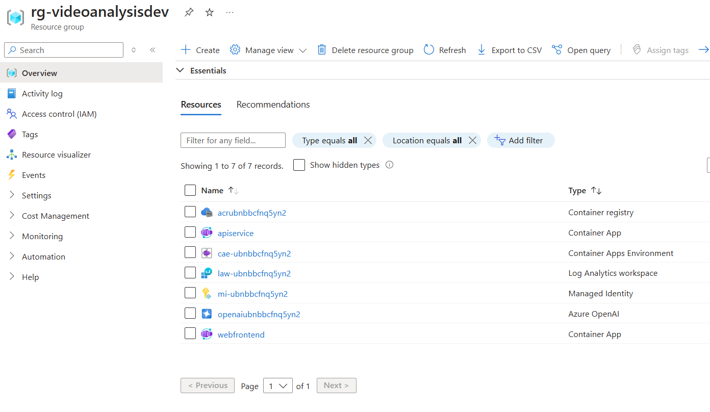
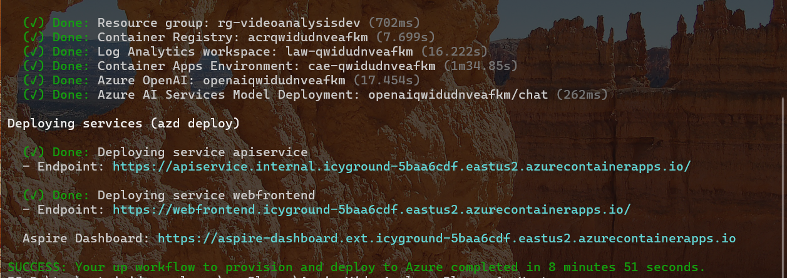
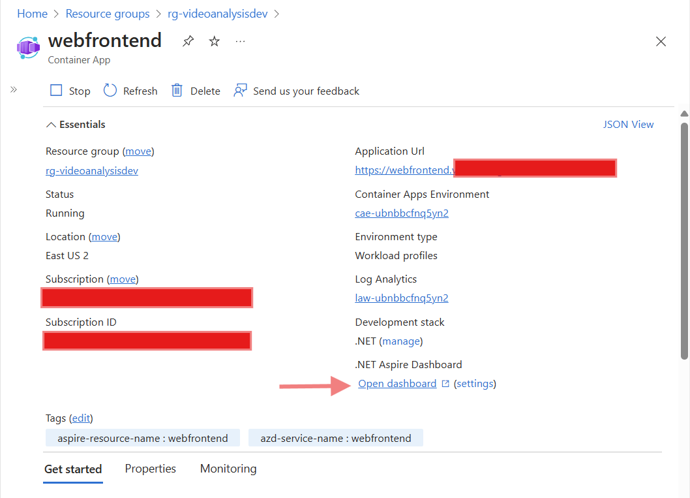
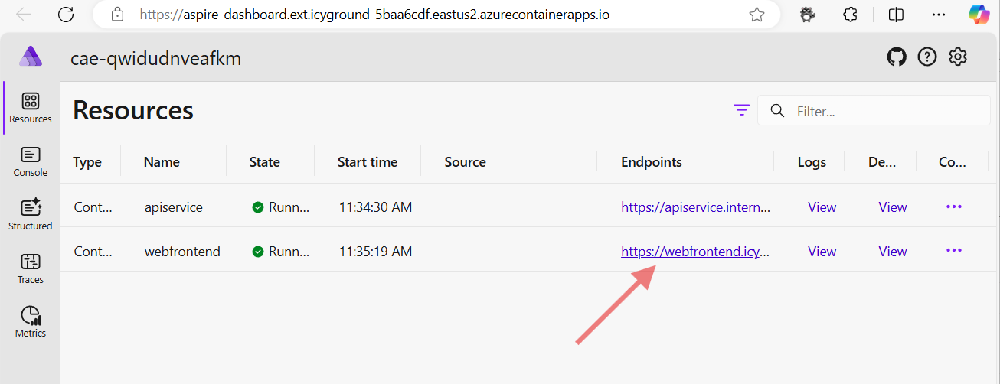
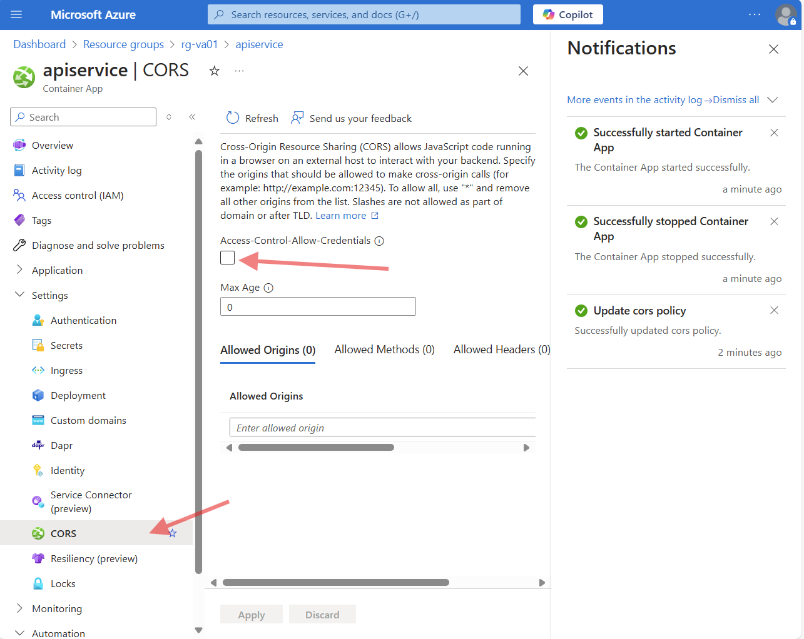
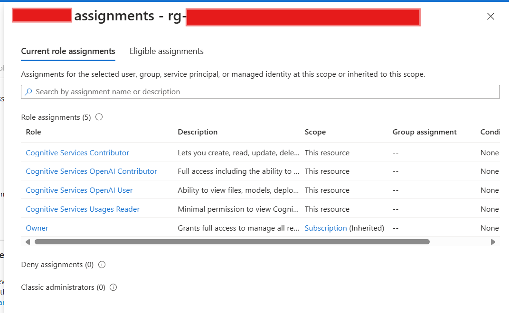
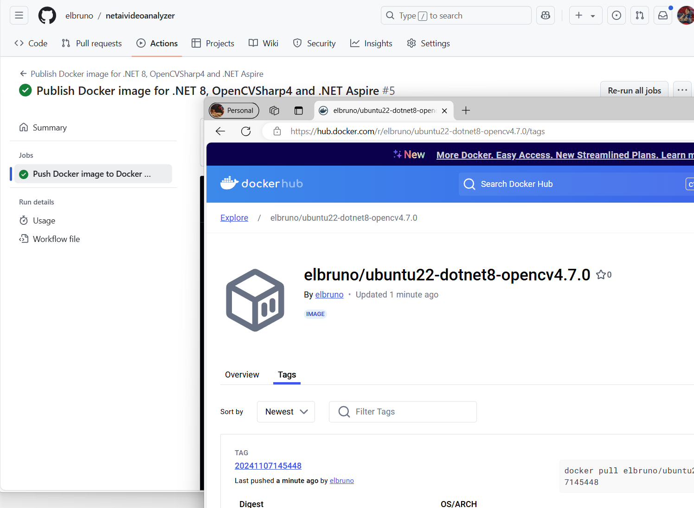

# Aspire + Blazor Demo

This page will describe the process to deploy the Aspire and Blazor solution to Azure. It will include detailed steps and references to deploy .NET Aspire projects to Azure, ensuring a smooth and efficient deployment process.


## Prerequisites

You can run the Azure Deploy process from a GitHub Codespace.

To work with .NET Aspire, you need the following installed locally:

- [.NET 8.0](https://dotnet.microsoft.com/en-us/download/dotnet/8.0)
- .NET Aspire workload:
Installed with the [Visual Studio installer](https://learn.microsoft.com/en-us/dotnet/aspire/fundamentals/setup-tooling?tabs=windows&pivots=visual-studio#install-net-aspire) or the [.NET CLI workload](https://learn.microsoft.com/en-us/dotnet/aspire/fundamentals/setup-tooling?tabs=windows&pivots=visual-studio#install-net-aspire).
- An OCI compliant container runtime, such as:
  - [Docker Desktop](https://www.docker.com/products/docker-desktop/) or [Podman](https://podman.io/).
- [Azure Developer CLI](https://learn.microsoft.com/en-us/azure/developer/azure-developer-cli/install-azd?tabs=winget-windows%2Cbrew-mac%2Cscript-linux&pivots=os-windows) installed locally. 

## Deploy to Azure

- Navigate to the AppHost project

    ```bash
    cd ./srcBlazor/AspireVideoAnalyserBlazor.AppHost
    ```

- Execute the `azd init` command to initialize your project with azd, which will inspect the local directory structure and determine the type of app.

    ```bash
    azd init
    ```
- Select **Use code in the current directory** when azd prompts you with two app initialization options.

- Select the **Confirm and continue initializing my app** option.

- Enter an environment name, which is used to name provisioned resources in Azure and managing different environments such as `dev` and `prod`.

  ***Note:** for the current scenario we will use the environment name **`videoanalysisdev`***

- In order to deploy the .NET Aspire project, authenticate to Azure AD to call the Azure resource management APIs.

    ```bash
    azd auth login
    ```

- Once authenticated, run the following command from the AppHost project directory to provision and deploy the application.

    ```bash
    azd up
    ```

- When prompted, **select the subscription** and **select the location** the resources should be deployed to. Once these options are selected the .NET Aspire project will be deployed.

- The final line of output from the azd command is a link to the Azure Portal that shows all of the Azure resources that were deployed:

    

- Once the deployment is complete, the console will display 3 uris:

  - (✓) Done: Deploying service apiservice
    Endpoint: `https://apiservice.<sampleurl>.azurecontainerapps.io/`

  - (✓) Done: Deploying service webfrontend
    Endpoint: `https://webfrontend.<sampleurl>.azurecontainerapps.io/`

  - Aspire Dashboard: `https://aspire-dashboard.<sampleurl>.azurecontainerapps.io`

    

- **The Deployment is complete!**

## Test the application

Open the Aspire Dashboard url from the comsole log.

Other option is to access the created resource in Azure. Navigate to the webfrontend container app and open the dashboard from the container app panel. In the Overview section, launch the Aspire Dashboard.



The Aspire Dashboard will display the 2 running services: apiservice and webfrontend. Navigate to the webfrontend service.



Now you can select a video in your local machine, and upload the video to get a description. You can also define the **number of sample frames** that are going to be used for the video analysis, and the **system prompt** and user **prompt used** to analyze the video.


## TroubleShooting

If your client Blazor App can't connect to the API Service app, you may need to check the following scenarius.

### Ingress Configuration

Reset the API Service Ingress configuration following these steps:

- In Resource Group in Azure, access to the `apiservice` Container App.

- In the `Settings` menu, access the Ingress option.

- Disable Ingress and save the changes.

- Enable Ingress.

- Validate the following values

  - `Accepting Traffic from anywhere` is selected.
  - `Ingress Type` is `HTTP`.
  - `Client Certification mode` is `Ignore`.
  - `Transport` is `Auto`.
  - `Insecure Connections` is not checked.
  - `Target Port` is `0`.

- Save the changes.

- Restart the Container App.


### CORS

Enable CORS in the API Service following these steps:

- In Resource Group in Azure, access to the `apiservice` Container App.

- In the `Settings` menu, access the CORS option.

- Check the `Access-Control-Allow-Credentials` and Save. This process should take a couple of seconds.

- Stop and Start the Container App.

  

### Validate Azure OpenAI roles

Validate that your user have the correct [Azure OpenAI roles](https://learn.microsoft.com/en-us/azure/ai-services/openai/how-to/role-based-access-control#azure-openai-roles) in the Resource Group, or at the Subscription Level.

Once the rigth roles assigned, the user should have a list similar to this one:



## ApiService Base Image for Azure Container Apps

The apiservice project uses a specific image that allows the use of OpenCVSharp4 in linux in Azure Container Apps.

The image was created using the docker definition file in `./srcBlazor/docker`, and published to docker hub [`elbruno/ubuntu22-dotnet8-opencv4.7.0:latest`](https://hub.docker.com/repository/docker/elbruno/ubuntu22-dotnet8-opencv4.7.0)

The `AspireVideoAnalyserBlazor.ApiService` project define this image as the **<ContainerBaseImage .>** to be used when published.

*AspireVideoAnalyserBlazor.ApiService.csproj* file definition:

```xml
<Project Sdk="Microsoft.NET.Sdk.Web">
	<PropertyGroup>
		<TargetFramework>net8.0</TargetFramework>
		<ImplicitUsings>enable</ImplicitUsings>
		<Nullable>enable</Nullable>
		<ContainerBaseImage>elbruno/ubuntu22-dotnet8-opencv4.7.0:latest</ContainerBaseImage>
		<EnableSdkContainerSupport>true</EnableSdkContainerSupport>
	</PropertyGroup>
</Project>
```

***Note:** The ContainerBaseImage official doc is [here](https://learn.microsoft.com/en-us/dotnet/core/docker/publish-as-container?pivots=dotnet-8-0#containerbaseimage)*

The docker file is published using the github action [Publish Docker image for .NET 8, OpenCVSharp4 and .NET Aspire](../.github/workflows/publishdockerimage.yml). 

The action is based on [Publishing images to Docker Hub](https://docs.github.com/en/actions/use-cases-and-examples/publishing-packages/publishing-docker-images#publishing-images-to-docker-hub).


