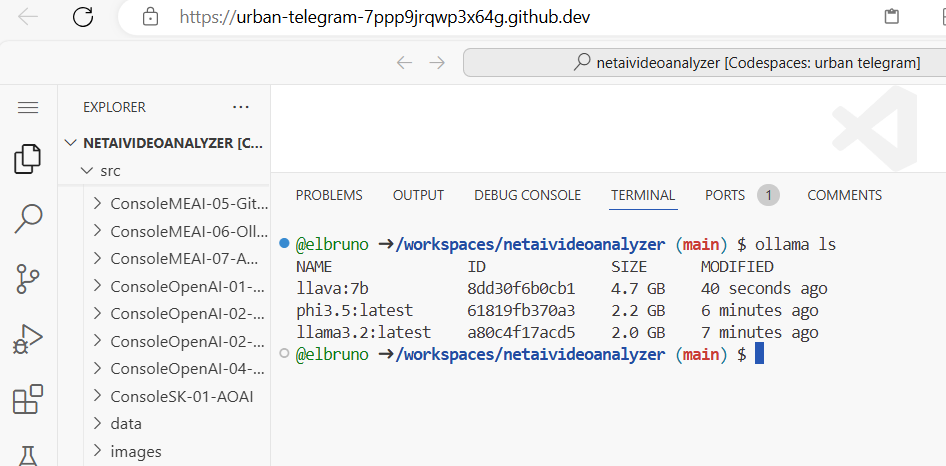

# Run sample using Ollama and local models

## Create a Codespace

- Create a new Codespace using the option **New with options**:

    

- Select the Ollama template for the Codespace

    

- Create the Codespace.

- The process could take a couple of minutes.

## Download Models from Ollama

Once the Codespace is created open a terminal and download the following models from Ollama

- [llava](https://ollama.com/library/llava)

- [llama3.2](https://ollama.com/library/llama3.2)

- [phi3.5](https://ollama.com/library/phi3.5)

Download the models, run the commands

```bash
ollama pull llava:7b
ollama pull llama3.2
ollama pull phi3.5
```

Check the downloaded models with the command:

```bash
ollama ls
```

The output should be similar to this one:


## Run the Spectre Console demo

- Navigate to the sample project folder using the command:

```bash
cd cd ./src/SpectreConsole-MEAI-01-Ollama/
```

- Run the project:

```bash
dotnet run
```

- You can expect an output similar to this one:

